# Collections vs Snapshot: Three-View Source Investigation

**Date:** 15 Sep 2026  
**Database:** MongoDB `cbva1_db` (read-only)  
**Scope:** Dashboard snapshot, Collection tab, Engagement tab — where each reads from and why numbers diverge.

---

## Executive answer

The **Dashboard snapshot** (Monthly Plan Evolution) does **not** read collection data at all — it reads **`pipeline_snapshots`** (Green/Amber/Bluesky/Total **plan**). That matches Excel because it is materialized from [`consolidated_summaries`](../backend/app/services/consolidated_import.py) + live engagements.

The **Collection tab** and **Engagement tab** both derive **collected** amounts from **`collection_transactions`**, but the **Dashboard Collections widget** (embedded below snapshots on the same page) uses **`GET /api/collections`**, which prefers txs and **falls back to `collection_entries.collected`**. For **FY 2025-26** there are **zero** `collection_transactions`; FY2526 monthly actuals exist **only** on `collection_entries` (imported aggregates). **`engagements.collected` is never synced to `collection_entries`** — only to the sum of txs via `_recompute_engagement_collected`.

**There is no sync job between `collection_entries.collected` and `engagements.collected`.**

---

## 1. What each view reads (DB + code path)

| View | Route / component | API | MongoDB source | Fields used |
|---|---|---|---|---|
| **Dashboard snapshot** | [`LeaderDashboard.jsx`](../frontend/src/pages/LeaderDashboard.jsx) → [`MonthlyEvolutionCard.jsx`](../frontend/src/components/dashboard/MonthlyEvolutionCard.jsx) | `GET /api/pipeline` | **`pipeline_snapshots`** | `green`, `amber`, `blue_sky`, `total`, `snapshot_type`, `label` |
| **Dashboard Collections widget** (same page, below snapshot) | [`LeaderDashboard.jsx`](../frontend/src/pages/LeaderDashboard.jsx) L199 → [`CollectionsTableReal.jsx`](../frontend/src/components/dashboard/CollectionsTableReal.jsx) | `GET /api/collections` | **`collection_transactions`** (if sum>0) else **`collection_entries`** | `amount_collected` / `collected`, `planned` |
| **Collection tab** | [`Collections.jsx`](../frontend/src/pages/Collections.jsx) → `CollectionsRollupTable` | `GET /api/engagements` + `GET /api/collection-transactions` | **`engagements`** + **`collection_transactions` only** | `monthly_plan`, `amount_collected` — **does not read `collection_entries`** |
| **Engagement tab** | [`Clients.jsx`](../frontend/src/pages/Clients.jsx) → [`EngagementsTable.jsx`](../frontend/src/components/clients/EngagementsTable.jsx) | same two APIs | **`engagements.collected`** (column) + **`collection_transactions`** (month cells) | `collected`, `monthly_plan`, tx sums |

### Data flow

```mermaid
flowchart TB
  subgraph snapshot [Dashboard Snapshot]
    PS[pipeline_snapshots]
    CS[consolidated_summaries]
    ENG1[engagements live G/A/BS]
    API1["GET /api/pipeline"]
    MAT["materialize_leader_derived_data"]
    CS --> MAT
    ENG1 --> MAT
    MAT --> PS
    PS --> API1
  end

  subgraph dashColl [Dashboard Collections widget]
    CT[collection_transactions]
    CE[collection_entries]
    API2["GET /api/collections"]
    CT --> API2
    CE --> API2
  end

  subgraph collTab [Collection tab]
    CT2[collection_transactions]
    ENG2[engagements.monthly_plan]
    FE1["collectionsRollup.js"]
    CT2 --> FE1
    ENG2 --> FE1
  end

  subgraph engTab [Engagement tab]
    CT3[collection_transactions]
    ENG3[engagements.collected]
    RECOMP["_recompute_engagement_collected"]
    CT3 --> RECOMP
    RECOMP --> ENG3
  end
```



### Backend code paths

**Snapshot:** [`backend/app/routers/pipeline.py`](../backend/app/routers/pipeline.py) `list_snapshots` L62–74 calls `materialize_leader_derived_data` then reads `pipeline_snapshots`.

**Collections API:** [`backend/app/routers/collections.py`](../backend/app/routers/collections.py) L81–83:

```python
tx_sum = sum(tx["amount_collected"] for tx in txs)
actual = tx_sum if tx_sum > 0 else (entry.get("collected", 0) if entry else 0)
```

**Tx → engagement:** POST/DELETE [`collection_transactions.py`](../backend/app/routers/collection_transactions.py) L125 → `_recompute_engagement_collected` (L60–74) sets `engagements.collected = sum(txs)` — **does not touch `collection_entries.collected`**.

**collection_entries.collected writes:** only via `PUT /api/collections/{entry_id}` with `{collected: ...}` ([`collections.py`](../backend/app/routers/collections.py) L196–197) or bulk FY2526 import (out-of-band; no in-repo importer).

**materialize_leader_derived_data:** upserts `collection_entries.planned` from `engagements.monthly_plan` but `$setOnInsert: {collected: 0}` only ([`engagement_derivation.py`](../backend/app/services/engagement_derivation.py) L229–247).

**Frontend hooks:**

| Hook | File | Endpoint |
|---|---|---|
| `usePipeline` | [`usePipeline.js`](../frontend/src/hooks/usePipeline.js) L9–17 | `/api/pipeline` |
| `useCollections` | [`useCollections.js`](../frontend/src/hooks/useCollections.js) L4–9 | `/api/collections` |
| `useEngagements` | [`useEngagements.js`](../frontend/src/hooks/useEngagements.js) | `/api/engagements` |
| `useCollectionTransactions` | [`useCollectionTransactions.js`](../frontend/src/hooks/useCollectionTransactions.js) L7–18 | `/api/collection-transactions` |

---

## 2. Per-leader sum: `engagements.collected` vs `collection_entries.collected`

Re-run: `python audit/compare_collected_sources.py`

Query (read-only):

```
db.engagements.find({ leader_id, fiscal_year, is_archived: false }) → sum(collected)
db.collection_entries.find({ leader_id, fiscal_year }) → sum(collected)
db.collection_transactions.find({ leader_id, fiscal_year }) → sum(amount_collected)
```

| Leader | FY | engagements Σ | collection_entries Σ | tx Σ | diff (eng − entry) | Notes |
|---|---:|---:|---:|---:|---:|---|
| abhitan | 2526 | 0 | 4,561,167 | 0 | −4,561,167 | entries only (no eng rows fy2526) |
| abhitan | 2627 | 12,009,000 | 0 | 12,009,000 | +12,009,000 | txs → eng; entries collected=0 |
| ak | 2526 | 0 | 21,414,814 | 0 | −21,414,814 | entries only |
| ak | 2627 | 0 | 0 | 0 | 0 | no txs |
| amol | 2526 | 75,884,085 | 78,259,952 | 0 | −2,375,867 | entries match sheet; eng stale |
| amol | 2627 | 25,077,988 | 0 | 25,077,988 | +25,077,988 | txs authoritative |
| biu | 2627 | 3,508,580 | 0 | 3,508,580 | +3,508,580 | |
| manan | 2526 | 79,682,209 | 90,317,710 | 0 | −10,635,501 | entries match sheet |
| manan | 2627 | 14,850,238 | 0 | 14,850,238 | +14,850,238 | |
| np | 2526 | 93,843,950 | 93,933,021 | 0 | −89,071 | |
| np | 2627 | 17,321,675 | 0 | 17,321,675 | +17,321,675 | |
| priyesh | 2526 | 147,207,821 | 147,207,821 | 0 | **0** | only leader where both match fy2526 |
| priyesh | 2627 | 32,897,545 | 0 | 32,897,545 | +32,897,545 | |
| ritesh | 2526 | 128,330,591 | 128,330,591 | 0 | **0** | match |
| ritesh | 2627 | 0 | 0 | 0 | 0 | no txs entered |
| varun | 2526 | 0 | 126,385,145 | 0 | −126,385,145 | entries only (no eng fy2526) |
| varun | 2627 | 46,308,471 | 0 | 46,308,471 | +46,308,471 | |
| vinay | 2526 | 0 | 3,150,000 | 0 | −3,150,000 | entries only |
| vinay | 2627 | 500,005,540,250 | 0 | 5,540,250 | +500B error | `PaymentZ Group` collected=500000000000 |

**FY 2025-26:** `collection_entries` holds sheet-imported monthly aggregates. `engagements.collected` is partially populated and never reconciled. **No txs** → Collection tab shows **₹0** for all months.

**FY 2026-27:** `collection_entries.collected` is **0** everywhere; **`collection_transactions` → `engagements.collected`** is the live path. Collection and Engagement tabs agree when month scope aligns, except vinay outlier.

---

## 3. Sync design (intended vs actual)

| Link | Intended? | Mechanism | Actually happens? |
|---|---|---|---|
| tx → `engagements.collected` | Yes | `_recompute_engagement_collected` on tx create/delete | Yes (FY2627) |
| tx → `collection_entries.collected` | **No** | — | Never |
| `collection_entries.collected` → `engagements.collected` | **No** | — | Never |
| Sheet FY2526 aggregates → `collection_entries` | Yes (import) | Out-of-band / manual | Yes — matches Excel |
| Sheet FY2526 → `engagements.collected` | **No** | — | Partial/stale |
| `engagements.monthly_plan` → `collection_entries.planned` | Yes | `materialize_leader_derived_data` | Yes (planned only) |
| Consolidated Excel → `pipeline_snapshots` | Yes | `materialize` + admin | Yes — snapshot matches Excel |

Collection tab footer ([`Collections.jsx`](../frontend/src/pages/Collections.jsx) L59–61) states collected = finance actuals from Engagement tab, but **only sums `collection_transactions`**, not `collection_entries`.

---

## 4. Authoritative source per metric

| Metric | Authoritative store | Why |
|---|---|---|
| **Plan snapshots (G/A/BS)** — Dashboard snapshot | **`pipeline_snapshots`** (+ consolidated import) | Matches Excel Summary |
| **FY25-26 monthly actual** — Dashboard Collections widget | **`collection_entries.collected`** | Only store with sheet aggregates; txs empty |
| **FY25-26 monthly actual** — Collection / Engagement tabs | **Not authoritative today** | Tabs use txs only → ₹0 or stale eng |
| **FY26-27 collected** — Engagement tab (client total) | **`collection_transactions` → `engagements.collected`** | Recomputed on every tx write |
| **FY26-27 collected** — Collection tab | **`collection_transactions`** | Same txs, client-level grouping |
| **FY26-27 collected** — Dashboard Collections widget | **`collection_transactions`** | entries.collected=0 when txs exist |

---

## 5. Root cause

1. **Dashboard snapshot vs Collection/Engagement tabs are different metrics.** Snapshot = **plan pipeline** (`pipeline_snapshots`). Tabs = **cash collected** (`collection_transactions` / `collection_entries`).

2. **FY 2025-26 split-brain.** Sheet truth is in **`collection_entries.collected`**. Collection and Engagement tabs ignore entries and only read **`collection_transactions`** (0 rows for fy2526). Dashboard Collections widget reads entries via API fallback → **matches Excel**.

3. **No sync between `collection_entries.collected` and `engagements.collected`.** Txs update engagements only. FY2526 entry aggregates were loaded separately; engagement `collected` was never back-filled (except priyesh/ritesh).

4. **Collection tab vs Engagement tab (FY2627): scope mismatch.** Collection tab defaults to **one selected month**. Engagement **Collected column** is **YTD per client** (all txs).

5. **Data quality:** `vinay` / `PaymentZ Group` / FY2627 has `engagements.collected = 500,000,000,000` while txs sum to ₹55.4L.

---

*Read-only investigation. No DB or code changes applied.*
