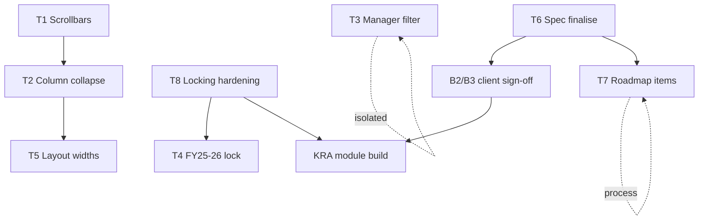

# CBVA Insight — Technical Audit (August 2026)

**Auditor scope:** Read-only. Source of truth: this repository + attached spec files at repo root.  
**Live product:** cbva.claraai.tech  
**Spec files:** `VC_Leaders_Performance Metric_26-27_V03 (1).xlsx`, `VC_Annual Review form_02.04.2026 (1).pdf`

---

## Executive Summary

1. **The codebase is a migrated FastAPI + MongoDB stack with a React frontend — not a live Base44 entity runtime.** Production data flows through JWT-authenticated REST APIs (`frontend/src/api/client.js:1-89`, `backend/app/core/database.py:9-17`). Base44 JSONC schemas in `frontend/base44/entities/` are legacy documentation with field-name drift from live MongoDB schemas.

2. **The appraisal module does not exist.** There are no KRA/scorecard/rating entities, routes, or UI (`grep KRA|scorecard|appraisal` — NOT FOUND). Roughly 40% of FY 26-27 KPIs can auto-compute from existing engagement/pipeline/collection data; the rest need new data collection (Client Engagement Log granularity, revenue mix, HR survey scores, behavioural ratings). See Appendix A.

3. **The biggest delivery risk is data integrity + locking, not UI.** Server-side FY locking exists for most write paths (`assert_fy_editable` in 12 routers), but gaps remain: pipeline FY-actuals, EL summary, baselines, and client-side collected/remarks edits bypass the lock. An appraisal system on this foundation without round-level server enforcement and persisted rollups will not survive partner dispute — client-side `guardEdit` alone is bypassable via direct API calls.

4. **Three client decisions block appraisal schema design:** B1 is decided (per-FY, per-leader weight config — build to this, confirm in writing). **B2** (which scorecard sheet is canonical), **B3** (separate Self/ExCo scores vs averaged), and the **missing 4th competency definition** remain open — pending Nikhil Popli. Do not default answers.

5. **Engagements table work (T1/T2/T5) is one refactor cluster.** `EngagementsTable.jsx` is 1,156 lines of native `<table>` + CSS sticky columns; horizontal scrollbar is deliberately hidden (`.scrollbar-x-none`). Column hide/collapse does not exist. Recommend targeted refactor, not AG Grid swap, unless scope expands beyond current grid.

---

## Phase 0 — Repository Inventory

### 0.1 Stack

| Layer | Technology | Citation |
|-------|------------|----------|
| Language | JavaScript (frontend), Python 3 (backend) | `frontend/package.json:1-4`, `backend/requirements.txt:1-11` |
| Framework | React 18 | `frontend/package.json:67-68` |
| Build | Vite 6 | `frontend/package.json:7-8`, `frontend/vite.config.js:1-9` |
| Styling | Tailwind CSS 3 + tailwindcss-animate | `frontend/package.json:78-79`, `frontend/tailwind.config.js` |
| Components | Radix UI + shadcn-style wrappers in `frontend/src/components/ui/` | `frontend/package.json:19-45` |
| State / data | TanStack Query 5 | `frontend/package.json:48`, `frontend/src/lib/query-client.js` |
| Routing | React Router 6 | `frontend/package.json:75`, `frontend/src/App.jsx:5-6` |
| Table virtualization | `@tanstack/react-virtual` (rows only) | `frontend/package.json:49`, `EngagementsTable.jsx:2,641-647` |
| Backend | FastAPI 0.138 + Motor (MongoDB) | `backend/requirements.txt:1-2`, `backend/app/main.py` |
| Auth | JWT (python-jose) + bcrypt | `backend/requirements.txt:5-6`, `backend/app/core/security.py:7-34` |
| Lockfile | `frontend/package-lock.json` | present |
| Legacy | `@base44/sdk`, `@base44/vite-plugin` in deps; **no runtime imports in `frontend/src/**`** | `frontend/package.json:15-16`; grep `@base44/sdk` in `frontend/src` — NOT FOUND |

### 0.2 Backend / Persistence

**Runtime:** Custom FastAPI API writing to MongoDB. Client init: `frontend/src/api/client.js:1-89` (axios + Bearer token). Backend DB init: `backend/app/core/database.py:9-17`.

**Not Base44-hosted at runtime.** Base44 entity JSONC files describe an earlier model; live schemas are Pydantic in `backend/app/schemas/`.

#### MongoDB collections (indexed at startup)

From `backend/app/core/database.py:50-103`:

| Collection | Purpose |
|------------|---------|
| `users` | Auth, roles, leader_id |
| `engagements` | Client-level BP rows (green/amber/blue_sky/collected/monthly_plan/el_status) |
| `pipeline_snapshots` | Pipeline evolution + fy_actual prior-year totals |
| `blue_sky_entries` | Monthly Blue Sky ledger |
| `collection_entries` | Monthly collection plan/actual summary |
| `collection_transactions` | Per-engagement per-month collected amounts |
| `actions` | Leader action tracker |
| `tasks` | Task list |
| `team_members` | Headcount roster |
| `hiring_requirements` | Hiring pipeline |
| `headcount_plans` | Board-approved headcount by designation |
| `baseline_plans` | Baseline green/amber/blue_sky targets |
| `el_summaries` | EL status roll-ups (partially computed live) |
| `assessments` | Tax assessment tracker (not KRA) |
| `client_meetings` | Client meeting log |
| `engagement_actions` | Per-engagement action items |
| `engagement_change_log` | Legacy; reads now use `audit_log` |
| `consolidated_summaries` | Firmwide consolidated Excel matrix |
| `audit_log` | Field-level change history |
| `leaders`, `financial_years`, `app_settings`, `clients`, `engagement_types` | Registry / admin (used, some unindexed) |

#### Entity field lists (live schemas — selected)

**`engagements`** — `backend/app/schemas/engagement.py:19-96`:
- `leader_id: str`, `fiscal_year: str`, `name: str`, `rel_partner: str`, `el_status: ELStatus`, `green/amber/blue_sky/collected: int (ge=0)`, `may_col`–`august_col: Optional[int]`, `monthly_plan: dict[str,int]`, `person_responsible: str`, `originator: str`, `client_scope: ClientScope`, `remarks: str`, `remarks_history: List[RemarkHistoryEntry]`, `is_archived: bool`, timestamps

**`team_members`** — `backend/app/schemas/team.py:6-47`:
- `leader_id`, `full_name`, `designation`, `email`, `annual_cost`, `joining_date`, `status`, `is_manager`, `is_leader`, `reports_to_member_id`, `fiscal_year`

**`financial_years`** — `backend/app/schemas/financial_year.py:7-22`:
- `slug`, `label`, `is_current`, `is_active`, **`is_editable`**, `sort_order`

**`users`** — `backend/app/schemas/user.py:6-33`:
- `role: Literal["admin","management","user"]`, `leader_id`, `designation`

**Base44 JSONC drift examples:**
- `frontend/base44/entities/User.jsonc:7-11` — role enum `leader` (runtime uses `user`)
- `frontend/base44/entities/FinancialYear.jsonc` — `is_locked` (runtime uses `is_editable` + `slug`)

**KRA/appraisal entities:** NOT FOUND — searched: `KRA`, `scorecard`, `appraisal`, `performance_metric`, `kpi_template` across `*.{py,jsx,js}`.

### 0.3 Directory Tree (3 levels)

```
cbva/
├── backend/                 FastAPI application, MongoDB, pytest, Docker
│   ├── app/
│   │   ├── core/            config, database, security, limiter
│   │   ├── schemas/         Pydantic models (24 files)
│   │   ├── routers/         22 API route modules
│   │   ├── services/        business logic, audit, fiscal year, import
│   │   └── dependencies/    auth dependencies
│   ├── api/                 Vercel serverless entry (index.py)
│   ├── tests/               6 pytest modules
│   └── csv/                 Per-leader Business Plan Excel files (import source)
├── frontend/                React SPA
│   ├── src/
│   │   ├── pages/           Route-level views
│   │   ├── components/      UI including EngagementsTable
│   │   ├── hooks/           TanStack Query wrappers
│   │   └── lib/             Context, FY helpers, formatters
│   └── base44/              Legacy entity JSONC + edge functions
├── csv-templates/           CBVA CSV/Excel import templates + filled samples
├── docs/                    Audit output (this file)
├── VC_Leaders_Performance Metric_26-27_V03 (1).xlsx
└── VC_Annual Review form_02.04.2026 (1).pdf
```

### 0.4 Route / Page Map

| Route | Component | Tabs / sections |
|-------|-----------|-----------------|
| `/home` | `Home` | Login (unauthenticated) |
| `/`, `/my-plan/dashboard` | `LeaderDashboard` | Pipeline chart, Monthly Evolution, Blue Sky table, Collections, EL Status widgets, Team metrics, Actions card, Meetings card |
| `/my-plan/engagements`, `/my-plan/clients`, `/my-plan` | `Clients` → `EngagementsTable` | Engagement grid + filter panel |
| `/my-plan/collections` | `Collections` | Read-only Planned vs Collected rollup |
| `/my-plan/team` | `TeamView` | Headcount table, team entry drawer |
| `/my-plan/actions` | `Actions` | Action tracker |
| `/my-plan/meetings` | `ClientMeetings` | Client meeting log table |
| `/my-plan/pipeline` | `LeaderPipeline` | Pipeline KPI cards |
| `/my-plan/clients/:clientId` | `ClientDetail` | Single client detail |
| `/my-plan/blue-sky-summary` | `BlueSkyPage` | Blue Sky summary |
| `/firmwide/consolidated` | `ConsolidatedSummary` | Firmwide matrix (mgmt/admin) |
| `/firmwide/clients` | `FirmwideClients` | All engagements cross-leader |
| `/firmwide/origination` | `Origination` | Nav disabled (`AppLayout.jsx:25`) |
| `/firmwide/board-pack` | `BoardPack` | Nav disabled (`AppLayout.jsx:26`) |
| `/firmwide/leaders`, `/firmwide/team` | Redirect → consolidated | `App.jsx:86-87` |
| `/firmwide/change-log` | `ChangeLog` | Admin audit log viewer |
| `/admin` | `AdminSettings` | Users, FY toggles, plans |

Nav definitions: `frontend/src/components/layout/AppLayout.jsx:13-32`. Routes: `frontend/src/App.jsx:72-94`.

### 0.5 Engagements Table

| Property | Value | Citation |
|----------|-------|----------|
| File | `frontend/src/components/clients/EngagementsTable.jsx` | — |
| Line count | **1,156** | file terminus `export default EngagementsTable` at line 1155 |
| Table primitive | **Native HTML `<table>`** | `EngagementsTable.jsx:752` |
| Library | `@tanstack/react-virtual` for **row virtualization only** | `EngagementsTable.jsx:2,641-647` |
| Not used | TanStack Table, AG Grid, shadcn DataTable | grep `@tanstack/react-table`, `AgGrid` — NOT FOUND |

Page wrapper: `frontend/src/pages/Clients.jsx:20-32` renders `<EngagementsTable key={...} fiscalYear={activeFY} />`.

### 0.6 Auth & Roles

**Identification:** JWT access token in `localStorage`; `GET /api/auth/me` on mount (`frontend/src/lib/AuthContext.jsx:25`, `backend/app/routers/auth.py:76-77`).

**Roles:** `admin` | `management` | `user` (`backend/app/schemas/user.py:11`).

| Role | Read scope | Write scope | UI |
|------|------------|-------------|-----|
| `user` | Own `leader_id` only | Own leader only | No leader switcher (`GlobalSelectorContext.jsx:44-47`, `LeaderFYSelector.jsx:19-21`) |
| `management` | All leaders (firmwide) | Own leader only | Firmwide nav (`AppLayout.jsx:128-138`) |
| `admin` | All | All leaders; FY always editable | Admin + Change Log |

**Enforcement:**
- **Server:** `get_current_user`, `require_roles`, `enforce_leader_scope`, `enforce_leader_write_scope` (`backend/app/dependencies/auth.py:11-53`)
- **Client:** `ProtectedRoute` on firmwide/admin routes (`frontend/src/components/auth/ProtectedRoute.jsx:4-9`, `App.jsx:88-93`)
- **Gap:** Route guards are client-only; API is the real enforcement. Direct API calls bypass UI guards — acceptable for leader scope, **not acceptable for appraisal rater rules** (which do not exist yet).

### 0.7 Fiscal-Year Handling

**Representation:** 4-char slug, Apr–Mar Indian FY (e.g. `2526`, `2627`). Calendar calc: `backend/app/services/fiscal_year.py:9-18`, `frontend/src/lib/fyMonths.js:16-34`.

**Threading:**
1. `useFinancialYears` → `GET /api/financial-years/` (`frontend/src/hooks/useFinancialYears.js:4-16`)
2. `GlobalSelectorProvider` holds `activeFY`, `selectedLeaderId` (`frontend/src/lib/GlobalSelectorContext.jsx:14-53`)
3. All data hooks pass `fiscal_year: activeFY` as query param
4. Edit gate: `isFyEditable()` / `assert_fy_editable()` — admin bypass (`frontend/src/lib/fiscalYear.js:22-32`, `backend/app/services/fiscal_year.py:39-57`)

**FY branching locations (non-exhaustive but verified):**

| Location | Mechanism |
|----------|-----------|
| `GlobalSelectorContext.jsx:36-42` | Auto-select current FY slug |
| `LeaderFYSelector.jsx:61-77` | FY dropdown |
| `LeaderDashboard.jsx:34-56` | All dashboard queries scoped to `activeFY` |
| `EngagementsTable.jsx:407-410,458` | Current + prior FY engagement fetch |
| `useEngagements.js:81-88` | `fiscal_year` query param |
| `usePipeline.js`, `useCollections.js`, `useBluesky.js`, `useTeam.js`, etc. | Same pattern |
| `backend/app/services/fiscal_year.py:75-126` | Calendar rollover; prior FYs set `is_editable: false` |
| `backend/app/services/consolidated_import.py:89-98` | Hardcoded `hist_fy2526_actual` row keys |
| `frontend/src/lib/consolidatedSummary.js:27-44` | Hardcoded prior-FY display keys |

**No single FY module on backend** — logic split between `fiscal_year.py`, `fy_calendar.py`, and per-router `fiscal_year: str = Query(...)`.

### 0.8 Testing, CI, Error Handling, Observability

| Area | Status | Citation |
|------|--------|----------|
| Backend tests | **6 modules:** auth, engagements, leader_scope, firmwide, audit_log, bluesky_ledger | `backend/tests/` |
| Frontend tests | **None** | grep `vitest`, `jest`, `*.test.` in `frontend/` — NOT FOUND |
| CI | **None in repo** | `.github/workflows/` — NOT FOUND |
| Deploy | Vercel (`backend/vercel.json:3-5`, `frontend/vercel.json`) | |
| Error boundary | `ErrorBoundary` at authenticated router | `App.jsx:69` |
| API errors | Toast on mutation failure | `useEngagements.js:114-118` |
| Audit trail | `audit_log` collection + admin UI | `backend/app/services/audit_service.py`, `ChangeLog.jsx` |
| Logging | loguru backend | `backend/requirements.txt:10` |

---

## Phase 1 — Ten Pending Tasks

### T1 — Add horizontal and vertical scroll bars to the Engagements tab

**Verdict:** PARTIAL

**Where it lives:** `frontend/src/components/clients/EngagementsTable.jsx:741-751`, `frontend/src/index.css:360-370`

**Current behaviour:**
- Scroll container: `<div ref={scrollRef} className="scrollbar-x-none overflow-auto" style={{ maxWidth: '100%', maxHeight: 'calc(100vh - 230px)', minHeight: '500px' }}>` (`EngagementsTable.jsx:747-750`)
- **Vertical scroll:** works; 12px vertical scrollbar styled (`index.css:368-370`)
- **Horizontal scroll:** content overflows (`table` has `minWidth: tableMinWidth`, line 752) but **horizontal scrollbar is hidden** — `.scrollbar-x-none::-webkit-scrollbar:horizontal { height: 0 }` (`index.css:360-362`)
- Outer card: `overflow-hidden` (`EngagementsTable.jsx:741`) — clips shadow only; inner div scrolls
- **Sticky interaction:** Left 5–6 columns use `position: sticky` + computed `left` offsets (`EngagementsTable.jsx:66-71,632-636,989-1028`). EL Status column adds `shadow` + `clipPath: inset(0 -15px 0 0)` to mask bleed (`EngagementsTable.jsx:763,170`). Header row 2 uses `top: 36` for two-row sticky header (`EngagementsTable.jsx:784-837`). Sticky columns scroll horizontally with the table until their `left` offset pins them — this is correct CSS sticky-in-scroll-container behaviour; **the problem is discoverability**, not broken sticky logic.

**What blocks it:** Deliberate CSS hiding horizontal scrollbar. Removing `scrollbar-x-none` or replacing with visible scrollbar class is the fix — no library change required.

**Ripple effects:** Sticky column shadows may need tuning once horizontal scrollbar consumes 12–17px viewport height/width. Footer sticky row (`EngagementsTable.jsx:1113-1144`) should be retested.

**Change surface:** 2 files, ~10 LOC. `EngagementsTable.jsx` (class change), optionally `index.css` (new scrollbar utility). Isolated.

**Complexity:** S | **Risk:** Low | **Reason:** CSS-only; sticky already implemented.

**Open questions for the client:** None.

---

### T2 — Make first three columns hideable/collapsible instead of frozen

**Verdict:** PARTIAL (freeze EXISTS via sticky; hide/collapse ABSENT)

**Where it lives:** Sticky: `EngagementsTable.jsx:66-71,632-636,756-837,989-1028,1113-1118`. Column config stub: `frontend/src/lib/fyTableConfig.js:1-4`

**Current behaviour:**
- **Frozen columns (6, not 3):** `#`, Client, [Scope if leader has int'l clients], Manager, Rel. Partner, EL Status — all `sticky z-10/z-20` with `left` offsets from `stickyLeftOffsets()` (`EngagementsTable.jsx:66-71`)
- Task mentions "Relationship Partner, Manager, EL Status" — actual freeze set is wider (includes `#`, Client, optional Scope)
- **No column visibility state:** grep `columnVisibility|hideColumn|collapsedColumn|localStorage.*column` — NOT FOUND
- Closest precedent: `showScopeColumn` toggled by leader config (`EngagementsTable.jsx:625`), not user preference
- `ENGAGEMENT_COLUMNS.base` in `fyTableConfig.js:2` lists column keys but is not wired to hide UI

**What blocks it:** Entire sticky offset system assumes fixed left columns. Collapsing Manager/RelPartner/EL Status requires: (1) state for visible columns, (2) dynamic `stickyLeftOffsets()`, (3) toggle UI, (4) optional `localStorage` or user-prefs API (neither exists — grep `user.*preference`, `localStorage` column — NOT FOUND for columns).

**Ripple effects:** `ClientFilterPanel.jsx` (filter keys for hidden columns), footer colspan (`EngagementsTable.jsx:629`), `engagementColumnWidths()` / `tableMinWidth`, CollectionsRollupTable uses similar sticky pattern (`CollectionsRollupTable.jsx:24-79`) but is separate.

**Does removing pinning help T1?** Yes — fewer sticky columns reduce horizontal budget eaten before scrollable financial columns (helps T5). T1 scrollbar fix is independent and compatible.

**Change surface:** `EngagementsTable.jsx` (~150–250 LOC), possibly new `useColumnPreferences` hook, `fyTableConfig.js`. Structural within one component.

**Complexity:** M | **Risk:** Med | **Reason:** Sticky offset math + virtualized rows + two header rows; easy to break alignment.

**Open questions for the client:** Should collapsed state persist per user across sessions?

---

### T3 — Clean up Manager column dropdown filter: AM and above only

**Verdict:** PARTIAL

**Where it lives:** Filter options: `EngagementsTable.jsx:418-425,806-816`. Row edit: `EngagementsTable.jsx:1008-1015` → `PersonSelect.jsx`. Data: `backend/app/schemas/engagement.py:35` (`person_responsible`), `backend/app/schemas/team.py:9` (`designation`)

**Current behaviour:**
- `managerOptions = mergePersonOptions(teamMembers.full_name, firmwideNames, uniqueManagers(clients), leaders.name)` (`EngagementsTable.jsx:418-425`)
- `mergePersonOptions` dedupes/sorts strings only (`frontend/src/lib/personNames.js:18-25`) — **no designation filter**
- `uniqueManagers(clients)` pulls distinct `person_responsible` values from loaded engagements (`frontend/src/lib/engagementFilters.js:130-137`)
- Designation hierarchy **exists** for team: `TEAM_DESIGNATIONS`, `designationRank()` (`frontend/src/lib/designations.js:6-40`) — Articles → Managing Partner
- `team_members.is_manager` flag exists (`backend/app/schemas/team.py:16`, `backend/app/routers/team.py:88`) but is **not used** in manager dropdown
- Manager on engagement is **free-text name string**, not FK to team member

**What blocks it:** Without joining manager name → team member → designation, junior names already stored on engagements will still appear in `uniqueManagers(clients)`. Filter options need to be sourced from `team_members` where `designationRank(designation) >= designationRank('Manager')` (or `is_manager === true`), plus optionally retain existing engagement values that match.

**No new engagement field required** if team roster is authoritative. If juniors appear only in historical engagement strings and not in team roster, they will remain as filter options until data is cleaned.

**Ripple effects:** `PersonSelect.jsx`, `AddEngagementModal.jsx` (same options), `ClientFilterPanel.jsx` if manager filter duplicated.

**Change surface:** `EngagementsTable.jsx` (~30 LOC), possibly `personNames.js` helper. Isolated.

**Complexity:** S | **Risk:** Low | **Reason:** Filter derivation change only; designation data exists.

**Open questions for the client:** Confirm "AM and above" maps to `Manager`, `Senior Manager`, `Director`, `Partner` etc. from `designations.js:23-34` — or does CBVA use "AM" as "Associate Manager" not in current enum?

---

### T4 — Hard-punch last year's leader-wise, month-wise collections into dashboard (non-editable)

**Verdict:** PARTIAL

**Where it lives:** FY lock: `backend/app/services/fiscal_year.py:39-57,116-126`. Dashboard prior FY: `LeaderDashboard.jsx:54-73`, `usePipeline.js` fy-actuals. Consolidated hist: `consolidated_import.py:95-96`. Engagements prior-year column: `EngagementsTable.jsx:458-469`

**Current behaviour:**
- FY 25-26 (`2526`) rows in MongoDB are **writable or locked depending on `financial_years.is_editable`** — auto-set `false` for non-current FY without explicit flag (`fiscal_year.py:116-126`)
- **Admin can always edit** any FY (`fiscal_year.py:40-41`, `fiscalYear.js:24-25`)
- Dashboard prior-year pipeline totals: `GET /api/pipeline/fy-actuals` + `PUT /api/pipeline/fy-actuals` (`pipeline.py:76-156`) — **PUT has no `assert_fy_editable`** (`pipeline.py:120-126`) — prior-year actuals remain editable
- `MonthlyEvolutionCard` exposes FY actual edit when `canEditFyActual` (`MonthlyEvolutionCard.jsx:116,245-267`)
- Consolidated import stores `hist_fy2526_actual` as matrix row key (`consolidated_import.py:95-96`) — separate from leader dashboard
- Engagements table shows prior-FY collected column from `useEngagements(selectedLeaderId, prevFySlug)` (`EngagementsTable.jsx:458-469`) — read from engagement `collected`/month fields, not a separate locked snapshot

**Three implementation shapes:**

| Shape | Codebase favour? |
|-------|------------------|
| (a) Static constants file | No — data already in MongoDB |
| (b) Seeded DB rows + lock flag | **Yes** — `financial_years.is_editable` + `pipeline_snapshots` fy_actual |
| (c) Computed read-only view | Partial — EL summary already computes live (`el_summary.py:41-88`) |

**Write paths touching FY 25-26 today:** Any engagement/collection/team write with `fiscal_year=2526` if admin or if `is_editable` true. Pipeline fy-actuals PUT always writable.

**T4 vs T8:** T4 is a **special case of T8** — lock FY 25-26 + close pipeline fy-actuals write path + optionally seed final numbers.

**Change surface:** `pipeline.py` (add `assert_fy_editable`), admin seed script or import, dashboard read-only UI for prior FY. ~50–100 LOC + data migration.

**Complexity:** M | **Risk:** Med | **Reason:** Must verify live DB values before locking; admin override policy needed.

**Open questions for the client:** Source of truth for FY 25-26 final numbers — consolidated Excel import vs sum of engagement transactions?

---

### T5 — Optimise Engagements tab layout: use empty space better

**Verdict:** PARTIAL

**Where it lives:** `EngagementsTable.jsx:39-64,746-752,854-900`. Page shell: `AppLayout.jsx:189` (sidebar), `ClientActionsLayout.jsx`

**Current behaviour:**
- `table-layout: fixed` (`EngagementsTable.jsx:752`)
- Column widths from `engagementColumnWidths()` (`EngagementsTable.jsx:46-58`):
  - `#`: 32px, Client: 180px, Scope: 100px, Manager/RelPartner/ELStatus: **100px each**, financial cols: 96px, month sub-cols: 80px, Remarks: **320px**, Expand: 32px
- Sticky left block ≈ 412px (+ scope 100px) before horizontal scroll begins
- **Header/body width mismatch:** Green/Amber/BlueSky/Total headers use 110–120px inline (`EngagementsTable.jsx:854-900`) while `<colgroup>` uses 96px (`EngagementsTable.jsx:51`) — causes visual cramping/misalignment
- `maxHeight: calc(100vh - 230px)` leaves vertical room; cramping is **horizontal**, in month/financial columns on right
- Page is full-width within content area; sidebar is collapsible (`AppLayout.jsx:189`) — not the primary cause

**What blocks it:** Fixed 100px person columns + 320px remarks + sticky budget. CSS-only width redistribution helps; meaningful fix likely combines T2 (collapse identity columns) + width table rebalance.

**Ripple effects:** Footer totals row, virtual row height estimate (`EngagementsTable.jsx:645`), `ClientFilterPanel` unaffected.

**Change surface:** `EngagementsTable.jsx` primarily (~80 LOC CSS/width). Isolated if T2 not bundled.

**Complexity:** S–M | **Risk:** Low | **Reason:** CSS/width tuning; no schema change.

**Open questions for the client:** None.

---

### T6 — Finalise KRA/KPI scoring system spec from Excel/PDF

**Verdict:** PARTIAL (spec artifacts exist; code ABSENT)

**Where it lives:** Spec: `VC_Leaders_Performance Metric_26-27_V03 (1).xlsx`, `VC_Annual Review form_02.04.2026 (1).pdf`. Code: NOT FOUND.

**Current behaviour:** No appraisal module in codebase. See Phase 2 and Appendices A/B.

**What blocks it:** Client decisions B2, B3, missing 4th competency definition. B1 decided but not in writing.

**Ripple effects:** Entire new module — schema, API, UI, permissions.

**Change surface:** N/A (spec/process task).

**Complexity:** XL (for implementation) | **Risk:** High | **Reason:** Foundational schema depends on unresolved spec conflicts.

**Open questions for the client:** B2, B3 — see Phase 2B.

---

### T7 — Add KRA/KPI items to project change list with priority tiers

**Verdict:** PARTIAL

**Where it lives:** [`frontend/FULLSTACK_ROADMAP.md:519-554`](frontend/FULLSTACK_ROADMAP.md) (in-repo backlog). [`frontend/src/pages/firmwide/ChangeLog.jsx`](frontend/src/pages/firmwide/ChangeLog.jsx) (runtime audit log — **not** a dev backlog).

**Current behaviour:**
- `FULLSTACK_ROADMAP.md` §1.3 lists 14 frontend production gaps — **no KRA/KPI items**
- Roadmap items 1–10 are partially stale (mock data removed, axios migration done, token refresh exists in `client.js:45-82`)
- `ChangeLog.jsx` queries `GET /api/audit-log/` — entity change history for admins

**What blocks it:** T6 spec finalisation. Process task — add section to roadmap or external tracker.

**Ripple effects:** None (documentation).

**Change surface:** `FULLSTACK_ROADMAP.md` ~20 lines.

**Complexity:** S | **Risk:** Low | **Reason:** Documentation only.

**Open questions for the client:** Is roadmap in repo the canonical change list, or does CBVA use external tracker (Jira/Notion)?

---

### T8 — Data locking mechanism

**Verdict:** PARTIAL

#### Write paths (enumerated)

| Endpoint | FY lock? | Citation |
|----------|----------|----------|
| POST/PUT/DELETE/PATCH engagements | Yes | `engagements.py:320,372,448,476` |
| POST/PATCH/DELETE engagement-actions | Yes | `engagement_actions.py:55,98,123` |
| POST/PUT/PATCH actions | Yes | `actions.py:55,96,121` |
| POST/PUT/PATCH/DELETE tasks | Yes | `tasks.py:54,85,106,127` |
| POST/PUT/DELETE team | Yes | `team.py:99,125,150` |
| POST/PUT/DELETE hiring | Yes | `hiring.py:49,74,96` |
| POST headcount | Yes | `headcount.py:44` |
| POST/PUT bluesky | Yes | `bluesky.py:175,267` |
| POST/PUT collections | Yes | `collections.py:118,188` |
| POST/DELETE collection-transactions | Yes | `collection_transactions.py:99,158` |
| POST/PUT/DELETE client-meetings | Yes | `client_meetings.py:104,130,154` |
| POST/PUT pipeline snapshots | **No** | `pipeline.py:185-210` |
| **PUT pipeline/fy-actuals** | **No** | `pipeline.py:120-126` |
| POST/PUT baselines | **No** | `baselines.py:44-80` |
| PUT el-summary | **No** | `el_summary.py:124-138` |
| POST/PUT/DELETE admin users/settings/FY | Admin only | `admin.py` |

**Client-side write paths bypassing `guardEdit`:**
- `setMonthCollected()` — no `canEdit` check (`EngagementsTable.jsx:539-564`) — calls collection-transactions API (server FY lock applies to API, but UI allows attempt)
- `updateRemarks()` — no `guardEdit` (`EngagementsTable.jsx:566-568`)

**Status/state fields today:**
- `financial_years.is_editable` — FY-level lock (`financial_year.py:32`)
- `baseline_plans.is_locked` — stored, **not enforced** on PUT (`baselines.py:60-80`)
- No `draft|submitted|locked|approved` on engagements or leader plans

**Submit/finalise action:** ABSENT — all edits immediate.

**Server vs client lock:** FY lock is **server-enforced** via `assert_fy_editable` (403). Client `guardEdit` is UX only. **Gaps above are real bypasses** for pipeline fy-actuals, baselines, el-summary.

**"Blocked until leaders fill data" / completeness:** ABSENT. No computed completeness metric. Would need definition, e.g.: all engagements have EL status set, all months in FY have planned values, team roster complete — none enforced.

**Audit trail:** EXISTS — `audit_log` with field diffs, actor, timestamp (`audit_service.py:182-318`). Admin query: `GET /api/audit-log/` (`audit.py:161-175`). Engagement field history via audit, not legacy `engagement_change_log` (`engagement_change_service.py:49-69`).

**What blocks full locking:** Close unguarded write routes; add leader-level submit state; enforce baseline `is_locked`; client-side parity on all edit surfaces.

**Ripple effects:** Dashboard FY actual editing, admin FY toggle UI, appraisal round state machine (Phase 2D).

**Change surface:** ~8 backend files, ~5 frontend files. Structural.

**Complexity:** L | **Risk:** High | **Reason:** Data integrity feature; partial lock worse than none if partners trust it.

**Open questions for the client:** What defines "complete" for a leader's BP entry before management can rate?

---

### T9 — Data sanitisation

**Verdict:** PARTIAL

**Amounts:**
- Stored as **integers** (paise/smallest unit — treated as whole INR in formatters) (`engagement.py:26-34`)
- Render via `formatINR` / `formatINRFull` — no currency symbols persisted (`formatCurrency.js:2-33`)
- `annual_cost` on team is float INR — unit confusion documented in roadmap (`FULLSTACK_ROADMAP.md:553-554`)

**Dates/months:**
- FY months: 2-char keys `"04"`–`"03"` in `monthly_plan` dict (`engagement.py:34`, `fyMonths.js:14`)
- Month labels derived at render via `getFyMonthLabelYear()` (`fyMonths.js:92-96`)
- Legacy: `may_col`, `june_col`, `july_col`, `august_col` as separate fields (`engagement.py:30-33`) alongside `monthly_plan` — dual representation

**FY definition:** Canonical Apr–Mar in `fyMonths.js:14` and `fiscal_year.py:9-18`. **Duplicated** in `consolidated_import.py:23-28`, `consolidatedSummary.js`, multiple components re-deriving labels.

**Leader identities:**
- `leader_id`: string slug (e.g. `manan`) — consistent
- `person_responsible`, `rel_partner`: **name strings** on engagement (`engagement.py:24,35`) — name-keyed, silent typo/join risk
- `mergePersonOptions` case-insensitive dedupe only (`personNames.js:33-35`)

**Nulls vs zeros:**
- `plannedForMonth`: missing key → `0` (`collectionsRollup.js:20-21`)
- `collectedForMonth`: missing → `0` (`collectionsRollup.js:25-26`)
- Display: `> 0 ? formatINRFull(x) : '-'` in footer (`EngagementsTable.jsx:1130-1131`) — **zero displays as dash**, null same as zero
- Aggregations sum zeros — empty cell and explicit zero indistinguishable in rollups

**FY collision/double-count:**
- Engagements unique on `(leader_id, fiscal_year, num)` (`database.py:56-58`) — no cross-FY collision
- Firmwide rollups query single `fiscal_year` param — double-count risk only if same engagement duplicated across FY slugs in data entry

**Change surface:** Data migration + normalization helpers. Structural for name→ID migration.

**Complexity:** M–L | **Risk:** Med | **Reason:** Mostly data quality; name keys need careful migration.

**Open questions for the client:** Are amounts in paise or rupees? Schema says int ge=0; formatters treat as rupees.

---

### T10 — Dependency Graph



**Single-PR clusters:**
- **PR1:** T1 + T2 + T5 (EngagementsTable refactor)
- **PR2:** T3 (isolated)
- **PR3:** T8 + T4 (locking)
- **PR4:** KRA module (after B2/B3 + schema)

---

## Phase 2 — KRA/KPI Module Readiness

### 2A — The Spec as It Stands

**Source files verified in repo:**
- `VC_Leaders_Performance Metric_26-27_V03 (1).xlsx` — sheets: `FirmsGoals_FY26-27`, `FY26-27_Leader_Scorecard`, `Client Engagement Log`, `FY26-27_LeaderPerformanceMetric`, `Table`, `Supprorting`, `LeadershipCompetencies`, `Ref`
- `VC_Annual Review form_02.04.2026 (1).pdf` — filled sample for leader VC, FY 25-26

#### Category weights (`FirmsGoals_FY26-27`, rows 16–19, cols C/E)

| Category | FY 26-27 | FY 25-26 |
|----------|----------|----------|
| Client Delivery | 30% (0.3) | 40% (0.4) |
| Business Development | 35% (0.35) | 40% (0.4) |
| Practice Development | 25% (0.25) | 10% (0.1) |
| Practice Management | 10% (0.1) | 10% (0.1) |

Verified via xlsx parse (repo root file, sheet `FirmsGoals_FY26-27`).

#### Rating scale
- **1–5** per KPI, with **non-uniform band definitions** in column G (Target Measurement) — examples verified in Scorecard sheet JSON extract:
  - Plan achieved: `3.5-5 Exceptional · 3-3.5 = 100-120% · 2.5-3 = 80-100% · 2-2.5 = 70-80% · 0-2 = <70%`
  - EL coverage: `3.5-5 Exceptional · 2.5-3.5 = 80-100% · 2-2.5 = 60-80% · 0-2 = <60%`
  - Collections: `3.5-5 Exceptional · 2.5-3.5 = 90-110% · 2-2.5 = 75-90% · 0-2 = <75%`
  - Blue Sky: `3.5-5 Exceptional · 3-3.5 = 90-110% · 2.5-3 = 75-90% · 2-2.5 = 60-75% · 0-2 = <60%`

#### FY 25-26 filled PDF output shape
From PDF text extraction (`VC_Annual Review form_02.04.2026 (1).pdf`, page 1):
- Columns: **Self Rating Avg | Self Wg Avg | ExCo Rating Avg | ExCo Wg Avg | Feedforward**
- Footer: **`Rating (FY25-26) 3.87  3.05`** — two separate final numbers (Self / ExCo), **not averaged**
- FY 25-26 category weights in PDF: Client Delivery 40%, Business Development 40%, Practice Development 10%, Practice Management 10%

---

### 2B — Blockers (prominent)

#### B1 — Weightages variable by FY AND per leader [DECIDED — confirm in writing]

**Client instruction (Nikhil Popli, verbal):** Category weights must be **admin-configurable, keyed by (FY, leader)**, with firm-wide default per FY when no override.

**Codebase today:** ABSENT. Nearest patterns:
- `baseline_plans` keyed by `(leader_id, financial_year_id)` (`baseline.py:7-8`) — amounts only, not KPI weights
- `headcount_plans` keyed by `(leader_id, fiscal_year, designation)` (`headcount.py:7-9`)
- No generic per-leader config entity

**Schema implication:** Separate `kpi_weight_config` entity keyed `(fiscal_year, leader_id)` — must NOT be embedded in KPI template rows (weights vary per leader; KPI definitions do not).

#### B2 — Conflicting scorecard sheets [OPEN — pending Nikhil Popli]

Both sheets total to 30/35/25/10 but decompose differently:

| Area | Scorecard sheet | PerformanceMetric sheet | Conflict |
|------|-----------------|-------------------------|----------|
| Client Delivery | 4 KPIs (0.10/0.05/0.10/0.05) | 4 KPIs — same weights; PM sheet merges revenue multiple into plan KPI | Minor merge difference |
| Business Development | 6 KPIs (0.05/0.10/0.05/0.05/0.05/0.05) | 4 KPIs (0.05/0.10/0.15/0.05) | **Quarterly client meetings: 5% vs 15%**; cross-sell split vs merged |
| Practice Development | 5 KPIs (5×0.05) | 3 KPIs (0.10/0.10/0.05) | **Omits utilisation/efficiency and colleague engagement** |
| Practice Management | 2 KPIs (0.05/0.05 incl. Judgement) | 1 KPI (0.10) | **Omits Judgement/Integrity line** |

**Do not pick one in code.** Schema must store KPI definitions as **data rows** keyed by `(fiscal_year, template_version, category, sort_order)` — not fixed columns.

#### B3 — Aggregation rule [OPEN — pending Nikhil Popli]

- Tasklist says: "individual marking + management marking + average"
- **CBVA precedent (PDF):** separate Self 3.87 and ExCo 3.05 — no combined column
- Schema/UI must support **reporting both separately**; optional combined score only if client decides weighting

#### Data gap — 4th competency

- `LeadershipCompetencies` sheet row 3: **"Four Core Competencies"**
- Rows 6–8 define only 3: Client Centricity, Commercial Ownership, People Leadership
- **"Judgement, Integrity & Credibility"** appears as Scorecard KPI row (Practice Management, 5%) with **no Meets Expectations criteria** anywhere in workbook
- This is a **data gap for CBVA**, not a code gap

---

### 2C — Data-Model Gap Analysis

See **Appendix A** for full KPI → data-availability table (17 Scorecard line items).

Summary counts (Scorecard sheet):
- **AUTO:** 5 KPIs (plan achieved, EL coverage, collections, Blue Sky, cross-sell partial)
- **PARTIAL:** 4 KPIs (client meetings, relationship ownership, revenue mix, utilisation)
- **MANUAL:** 5 KPIs (behavioural competencies, self-development, people leadership, succession, practice management compliance)
- **NEW DATA:** 3+ KPIs (eminence counts, EE survey/attrition, revenue multiple benchmarks, Client Engagement Log structure)

---

### 2D — Schema Proposal

See **Appendix B**. Cross-reference T8: four-round appraisal flow requires round state machine + server-side rater enforcement. **Existing JWT/RBAC is necessary but insufficient** — without appraisal-specific write rules, a leader could PATCH another user's rating via crafted API request.

---

## Phase 3 — Cross-Cutting Findings

### 3.1 Architectural Fitness — EngagementsTable

**Recommendation: targeted refactor in place; do not swap table library yet.**

Reasoning:
- 1,156-line monolith (`EngagementsTable.jsx`) but patterns are coherent: colgroup widths, sticky offsets, virtualizer, filter integration
- T1 is CSS-only; T2/T5 require column state + width rework within same file
- AG Grid / TanStack Table migration: **XL cost**, high regression risk for sticky two-row headers + footer + expanded row panels (`EngagementExpandedPanel`, line 388)
- Revisit library swap only if CBVA needs column reorder, CSV export, or pivoting beyond current scope

### 3.2 Permission Model

| Capability | Status |
|------------|--------|
| Leader data scoping | EXISTS server-side |
| Role-based route access | EXISTS client + server |
| FY edit lock | PARTIAL server-side |
| Appraisal rater rules | ABSENT |
| Leader cannot see ExCo rating before release | ABSENT (policy + code) |

**Minimum viable fix for appraisal:** New `rating_record` writes validated server-side: `(round, rater_id, subject_leader_id, role)` rules enforced in FastAPI dependency, not React.

### 3.3 Performance

| Hotspot | Detail | Citation |
|---------|--------|----------|
| Client-side filter | Full engagement array re-filtered on every filter change | `EngagementsTable.jsx:570-571`, `engagementFilters.js:73-128` |
| No pagination | All engagements for leader+FY loaded at once | `useEngagements.js:81-88` |
| Virtualization | Row virtualizer helps DOM node count | `EngagementsTable.jsx:641-647` |
| N+1 | Prior FY + transactions separate queries — acceptable at ~10 leaders × N clients scale | `EngagementsTable.jsx:458,479` |
| Derived invalidation | Engagement update invalidates pipeline, collections, consolidated | `useEngagements.js:7-14` |

At current scale (~10 leaders, tens to low hundreds of engagements per leader), performance is adequate. Firmwide all-clients view (`FirmwideClients.jsx`) will degrade without pagination (roadmap item 12, `FULLSTACK_ROADMAP.md:549`).

### 3.4 Technical Debt in Path of This Work

1. **Hidden horizontal scrollbar** — user-visible bug masquerading as missing feature (`index.css:360-362`)
2. **Sticky + width duplication** — header inline widths ≠ colgroup (`EngagementsTable.jsx:854-900` vs `46-58`)
3. **Name-keyed person fields** — blocks reliable T3 and appraisal rater identity (`engagement.py:24,35`)
4. **Unguarded write routes** — blocks T8 (`pipeline.py:120`, `baselines.py:60`, `el_summary.py:124`)
5. **Roadmap staleness** — items 1, 8, 10 partially resolved (`FULLSTACK_ROADMAP.md:525-543` vs current code)
6. **`baseline_plans.is_locked` unenforced** — false sense of lock (`baselines.py:60-80`)

### 3.5 What Could Not Be Determined

| Item | Why |
|------|-----|
| Live MongoDB row counts and data completeness | No DB access in audit environment |
| Whether FY 25-26 `is_editable` is false in production | Runtime `financial_years` collection not queried |
| Actual FY 25-26 collection totals vs spreadsheet | Requires comparing live DB to BP Excel in `backend/csv/` |
| Base44 production entity contents | Platform not audited; repo is source of truth per brief |
| Which scorecard sheet CBVA will adopt | B2 open — client decision |
| Whether appraisal scores should be averaged | B3 open — PDF contradicts tasklist |
| "AM and above" exact designation mapping | CBVA HR taxonomy not in code (`designations.js` has Manager, not AM) |
| Paise vs rupees for engagement integers | Schema + formatters ambiguous (`engagement.py:26`, `formatCurrency.js:2`) |

---

## Phase 4 — Prioritised Recommendation

| # | Task | Verdict | Complexity | Risk | Blocked by | Blocks | Phase |
|---|------|---------|------------|------|------------|--------|-------|
| 1 | T1 Scrollbars | PARTIAL | S | Low | — | — | P2 quick-win |
| 2 | T3 Manager filter | PARTIAL | S | Low | AM designation mapping | — | P2 quick-win |
| 3 | T2 Column collapse | ABSENT | M | Med | Client pref on persist | T5 | P2 quick-win |
| 4 | T5 Layout | PARTIAL | S–M | Low | T2 optional | — | P2 quick-win |
| 5 | T8 Locking | PARTIAL | L | High | Completeness definition | T4, KRA | P3 structural |
| 6 | T4 FY25-26 punch | PARTIAL | M | Med | T8, data source sign-off | — | P3 structural |
| 7 | T6 Spec | PARTIAL | — | High | B2, B3 | KRA schema | Client |
| 8 | T7 Roadmap | PARTIAL | S | Low | T6 | — | Process |
| 9 | KRA module | ABSENT | XL | High | T8, B2, B3, B1 written | — | P4 appraisal |

### Quick wins (1–2 days, no schema change)
- T1: Remove `scrollbar-x-none`, verify sticky still works
- T3: Filter `managerOptions` by `designationRank >= Manager`
- T5: Rebalance colgroup widths; align header inline widths

### Structural (sequence carefully)
- T1+T2+T5: EngagementsTable refactor PR
- T8: Close pipeline fy-actuals, baselines, el-summary gaps; add submit/completeness model
- T4: Special case of T8 for slug `2526`

### Blocked on client (consolidated)

| ID | Question | Owner | Status |
|----|----------|-------|--------|
| B1 | Per-(FY, leader) weight config — confirm in writing | Nikhil Popli | Decided verbally — **needs written sign-off** |
| B2 | Canonical sheet: `FY26-27_Leader_Scorecard` (17 KPIs) vs `FY26-27_LeaderPerformanceMetric` (12 KPIs) | Nikhil Popli | **OPEN** |
| B3 | Report Self + ExCo separately (per PDF) or average? If average, what weighting? | Nikhil Popli | **OPEN** |
| B4 | Define "Judgement, Integrity & Credibility" competency criteria (4th competency) | Nikhil Popli | **OPEN** |
| T3 | Does "AM and above" = `Manager`+ in `designations.js`? | Nikhil Popli | **OPEN** |
| T4 | Source of truth for FY 25-26 locked collection numbers | Nikhil Popli | **OPEN** |
| T8 | Definition of "complete" BP entry before management rating | Nikhil Popli | **OPEN** |
| T7 | Is `FULLSTACK_ROADMAP.md` the canonical change list? | Nikhil Popli | **OPEN** |

---

## Appendix A — KPI → Data Availability Table

Based on `FY26-27_Leader_Scorecard` sheet (17 weighted line items). PerformanceMetric sheet differs per B2.

| KPI (abbreviated) | Category | Sub-weight | Classification | Existing field or gap |
|-------------------|----------|------------|----------------|----------------------|
| Agreed Plan vs achieved | Client Delivery | 0.10 | AUTO | Sum `engagements.green+amber+blue_sky` vs `baseline_plans` / pipeline board plan — `engagement.py:26-28`, `baseline.py:7-11`, `LeaderDashboard.jsx:38-39` |
| EL coverage (% engagements with EL) | Client Delivery | 0.05 | AUTO | Count `engagements` by `el_status` — `engagement.py:25`, `el_summary.py:43-58` computes live |
| Collections monthwise vs plan | Client Delivery | 0.10 | AUTO | `monthly_plan` + `collection_transactions` — `engagement.py:34`, `collectionsRollup.js:7-27`, `collection_transaction.py` |
| Client Centricity (behavioural) | Client Delivery | 0.05 | MANUAL | No behavioural rating entity — NOT FOUND |
| Eminence (articles, forums) | Business Development | 0.05 | NEW DATA | No article/webinar count entity — NOT FOUND |
| Blue Sky plan + revenue mix A-C-L | Business Development | 0.10 | PARTIAL | Blue Sky: `blue_sky_entries` (`bluesky.py`); revenue mix A-C-L: **NOT FOUND** |
| Cross-sell value | Business Development | 0.05 | NEW DATA | `extended.py:CrossSellEntry` schema exists — **no router/collection** — NOT FOUND in `database.py` indexes |
| Quarterly client meetings | Business Development | 0.05 | PARTIAL | `client_meetings` exists (`client_meetings.py:15-37`) — lacks quarterly plan vs actual structure from `Client Engagement Log` sheet |
| Lead/develop client relationships | Business Development | 0.05 | PARTIAL | `client_meetings.client_name`, remarks — no relationship goal tracking per Engagement Log sheet row 6 |
| Commercial Ownership (behavioural) | Business Development | 0.05 | MANUAL | No rating entity |
| Succession pipeline | Practice Development | 0.05 | MANUAL | `team_members.reports_to_member_id` (`team.py:17`) — no shadow P&L / development plan fields |
| Utilisation & efficiency | Practice Development | 0.05 | NEW DATA | Revenue multiple, income per colleague — **NOT FOUND** |
| Colleague engagement & culture | Practice Development | 0.05 | NEW DATA | EE survey score, attrition — **NOT FOUND** (team has `status` only) |
| Self-development | Practice Development | 0.05 | MANUAL | No coach/training attendance entity |
| People Leadership (behavioural) | Practice Development | 0.05 | MANUAL | No rating entity |
| Firm timelines compliance | Practice Management | 0.05 | MANUAL | No timesheet/HR compliance tracking in app |
| Judgement, Integrity & Credibility | Practice Management | 0.05 | MANUAL | No criteria in workbook; no code |

**LeadershipCompetencies sheet (3 defined × 5% each):** All MANUAL — require rating UI + storage.

---

## Appendix B — Proposed Schema (Design Only)

### Entity: `kpi_template_row` (NEW)
- `id`, `fiscal_year`, `template_version` (e.g. `scorecard` | `performance_metric`), `category`, `category_label`, `macro_kra`, `kpi_text`, `sub_weight_default`, `target_measurement_text`, `rating_bands` (JSON — non-uniform per KPI), `frequency_source`, `exceptional_criteria`, `sort_order`, `is_active`
- KPI definitions vary by FY but **not** by leader (per B1)

### Entity: `kpi_weight_config` (NEW)
- `id`, `fiscal_year`, `leader_id` (nullable = firm default), `category`, `weight` (decimal)
- Unique: `(fiscal_year, leader_id, category)` with fallback chain: leader override → FY default
- **Separate from template** (B1 decided)

### Entity: `scorecard_instance` (NEW)
- `id`, `fiscal_year`, `leader_id`, `template_version`, `status` (`draft|in_progress|submitted|locked`), `created_at`, `updated_at`

### Entity: `appraisal_round` (NEW)
- `id`, `scorecard_instance_id`, `round_type` (`mid_self|mid_mgmt|ye_self|ye_mgmt`), `status` (`open|in_progress|submitted|locked`), `opens_at`, `due_at`, `submitted_at`, `submitted_by`
- State transitions enforced server-side

### Entity: `rating_record` (NEW)
- `id`, `round_id`, `kpi_template_row_id`, `rater_user_id`, `rater_role`, `rating_value` (1–5), `comment` (feedforward text), `created_at`, `updated_at`
- Unique: `(round_id, kpi_template_row_id, rater_user_id)`

### Entity: `competency_rating` (NEW — if B2 → Scorecard)
- `id`, `round_id`, `competency_key`, `rating_value`, `comment`, `rater_user_id`

### Computed rollups: **persist on submission**
- `category_avg`, `category_weighted_avg`, `overall_self`, `overall_exco` stored on `scorecard_instance` at round submit
- **Rationale:** B1 weights change retroactively; T8 locking requires point-in-time snapshot; PDF shows pre-computed weighted columns

### Access control rules (minimum)
| Actor | Can |
|-------|-----|
| Leader (`user`) | CRUD own self-ratings in open self rounds only |
| Management | CRUD management ratings for all leaders in open mgmt rounds |
| Admin | Configure weights, templates, override locks |
| Leader viewing ExCo ratings | Policy flag — default hidden until round `locked` |

### Extensions to existing entities
- `client_meetings`: add `relationship_owner_primary`, `relationship_owner_secondary`, `quarter`, `meeting_scheduled`, `senior_leadership_updated` per Engagement Log sheet
- Optional: `person_id` FK on engagements replacing name strings (T9 debt)

---

## Appendix C — Search Log

All patterns run against `c:\Users\pc\Desktop\clara\cbva` unless noted.

| Pattern | Scope | Result |
|---------|-------|--------|
| `Base44\|supabase\|firebase` | `*.{ts,tsx,js,jsx,json}` | Base44 only in package.json, base44/, vite config — not in src runtime |
| `@base44/sdk` | `frontend/src/**` | NOT FOUND |
| `Engagement\|engagements` | `*.{ts,tsx,js,jsx}` | Found — primary table in `EngagementsTable.jsx` |
| `KRA\|scorecard\|appraisal\|performance_metric\|kpi_template` | `*.{py,jsx,js,md}` | NOT FOUND |
| `columnVisibility\|hideColumn\|collapsedColumn\|localStorage.*column` | `*.{jsx,js,py}` | NOT FOUND |
| `designation\|is_manager\|seniority` | codebase | Found in team schemas, designations.js — not in manager filter |
| `is_editable\|assert_fy_editable\|is_locked\|guardEdit\|canEdit` | `*.{py,jsx,js}` | Found — see T8 |
| `KPI\|KPICard` | frontend | KPICard is dashboard widget only — not appraisal |
| `mergePersonOptions\|person_responsible` | frontend | Found — name-based manager handling |
| `scrollbar-x-none\|sticky` | frontend CSS/JSX | Found — EngagementsTable, CollectionsRollupTable |
| `.github/workflows/` | repo | NOT FOUND |
| `vitest\|jest\|*.test.` | frontend | NOT FOUND |
| `docs/` directory | repo | NOT FOUND at audit start; created for this report |
| `VC_Leaders_Performance*26-27*.xlsx` | repo | FOUND at repo root (space in filename) |
| `*.xlsx` glob initial | repo | Missed due to filename space — found via `Get-ChildItem -Recurse -Filter *.xlsx` |
| `leaderData.js\|leaderData2627.js` | frontend | NOT FOUND (roadmap item stale) |
| `base44Client.js` | frontend/src | NOT FOUND (removed) |
| `useClientActions` file | frontend | NOT FOUND — lives in `ClientActionsContext.jsx:101-103` |
| `@tanstack/react-table\|AgGrid` | frontend | NOT FOUND |
| `CrossSellEntry` router | backend | Schema in extended.py — no router in main.py |
| `assessment` POST/PUT | backend/routers | NOT FOUND — read-only GET only |
| `per-user config\|weight.*leader` | codebase | NOT FOUND |

---

*End of audit. Generated August 2026. No application code was modified.*

---

## Addendum — Follow-up Findings (resolved without client input)

Follow-up to Items flagged in Phase 4 (T3 designation mapping, T9 amount units). Resolved via codebase review and **read-only** MongoDB queries against `cbva1_db` (`backend/.env:2`). No application code or database data was modified.

### Resolved open questions (from original audit)

| Original open question | Resolution |
|------------------------|------------|
| T3: Does "AM and above" = `Manager`+ in `designations.js`? | **Resolved** — see Item A below |
| T9: Are amounts in paise or rupees? | **Resolved** — see Item B below |

---

### Item A — T3 "AM and above" designation mapping

#### A.1 Code designation enum and rank order

Source: [`frontend/src/lib/designations.js:6-40`](frontend/src/lib/designations.js)

**`TEAM_DESIGNATIONS`** (dropdown in [`EditMemberDrawer.jsx:55`](frontend/src/components/team/EditMemberDrawer.jsx), [`TeamEntryDrawer.jsx:15`](frontend/src/components/team/TeamEntryDrawer.jsx)): Articles, Analyst, Associate, Manager, Senior Manager, Other.

**`DESIGNATION_ORDER`** (ascending rank — used by `designationRank()` at `designations.js:37-39`):

| Rank | Designation |
|------|-------------|
| 0 | Articles |
| 1 | Analyst |
| 2 | Associate |
| 3 | Manager |
| 4 | Senior Manager |
| 5 | Director |
| 6 | Business Leader |
| 7 | Partner |
| 8 | Managing Partner |
| 9 | Other *(any string not in list — including unknown values)* |

Grep `Assistant Manager|Associate Manager|\bAM\b` in `*.{js,jsx,py,jsonc}`: **NOT FOUND** in code enum.

#### A.2 Live data — read-only MongoDB query

**Database:** `cbva1_db` (from `backend/.env:2`)  
**Collection:** `team_members`  
**Query (read-only):**

```javascript
db.team_members.aggregate([
  { $group: { _id: "$designation", count: { $sum: 1 } } },
  { $sort: { count: -1 } }
])
```

**FY scope:** `db.team_members.count_documents({ fiscal_year: "2526" })` → **0**. `db.team_members.count_documents({ fiscal_year: "2627" })` → **129**. All designation counts below are FY 26-27 only.

**Results:**

| designation | count |
|-------------|------:|
| Articles | 43 |
| **Assistant Manager** | **21** |
| Manager | 14 |
| Senior Executive | 11 |
| Executive | 10 |
| Associate | 8 |
| Senior Manager | 6 |
| Partner | 5 |
| Director | 3 |
| Consultant | 2 |
| Atharva Janardan Dixit Hardikar | 1 |
| Babli Sharma | 1 |
| Riddhi Vijan | 1 |
| Pratik Muktaji Shinde | 1 |
| Abhaykumar Ranapratap Singh | 1 |
| Vinay Prakashchand Sethy | 1 |

**Total documents:** 129.

**Example row** (confirms string used in live data, not abbreviation "AM"):

```javascript
db.team_members.findOne({ full_name: "Vivek Sheth" })
// → { designation: "Assistant Manager", fiscal_year: "2627", ... }
```

#### A.3 Does "AM" exist in live data?

| String | In DB? | In code enum? |
|--------|--------|---------------|
| `AM` | No | No |
| `Associate Manager` | No | No |
| **`Assistant Manager`** | **Yes (21 rows)** | **No** |

**Answer:** CBVA's "AM" is stored as **`Assistant Manager`**, not a separate `"AM"` code.

#### A.4 Rank of Assistant Manager in code today

`designationRank("Assistant Manager")` → index **not found** → returns `DESIGNATION_ORDER.length` (= **9**, same as `"Other"`) per `designations.js:37-39`.

This ranks Assistant Manager **below every known grade**, including Articles — which is wrong for filtering purposes. Executive and Senior Executive (21 rows combined) have the same problem.

#### A.5 Code enum vs live data comparison

| Live DB value | Count | In `DESIGNATION_ORDER`? | Filter implication |
|---------------|------:|-------------------------|-------------------|
| Assistant Manager | 21 | No | **Must add** before rank-based filter works |
| Executive | 10 | No | Junior — exclude from "AM and above" |
| Senior Executive | 11 | No | Junior — exclude from "AM and above" |
| Consultant | 2 | No | Unknown rank |
| Analyst | 0 | Yes | Enum unused in live data |
| 6× person full names as designation | 6 | No | **Data error** — breaks any designation-based filter |

**Free-text drift:** UI dropdown (`TEAM_DESIGNATIONS`) omits Assistant Manager, Executive, Senior Executive — values entered via BP import bypass the enum ([`EditMemberDrawer.jsx:55`](frontend/src/components/team/EditMemberDrawer.jsx) only offers six options). This explains enum/data mismatch.

**Engagement manager field (separate from team roster):** `person_responsible` is free-text on engagements (`backend/app/schemas/engagement.py:35`). Top values from read-only query:

```javascript
db.engagements.aggregate([
  { $group: { _id: "$person_responsible", count: { $sum: 1 } } },
  { $sort: { count: -1 } },
  { $limit: 5 }
])
```

| person_responsible | count |
|--------------------|------:|
| *(empty string)* | 277 |
| Shrenik Nishar / Priyanka | 33 |
| Amit Shetty | 31 |

Manager filter options merge team names + engagement strings ([`EngagementsTable.jsx:418-425`](frontend/src/components/clients/EngagementsTable.jsx)) — designation rank cannot filter historical engagement strings without name→team-member join.

#### A.6 Recommendation for T3 manager-column filter

1. **"AM and above" = `Assistant Manager` and above** — confirmed from live data, not shorthand for Manager-only.
2. **Extend `designations.js`** with CBVA's actual ladder before filtering:

   `Articles → Associate → Executive → Senior Executive → Assistant Manager → Manager → Senior Manager → Director → Business Leader → Partner → Managing Partner → Other`

3. **Filter cutoff (after enum fix):** include team members where `designationRank(d) >= designationRank("Assistant Manager")`. This includes Assistant Manager, Manager, Senior Manager, and leadership tier; excludes Articles, Associate, Executive, Senior Executive.
4. **T3 is not a one-line filter tweak.** Sequence: (a) fix enum + UI dropdown, (b) clean 6 malformed designation rows (person names stored as designation), (c) then apply rank filter to `managerOptions` derivation in [`EngagementsTable.jsx:418-425`](frontend/src/components/clients/EngagementsTable.jsx). Optionally map `person_responsible` strings to team member records by normalized name match to infer seniority for filter options.

**Verdict update for T3:** remains **PARTIAL**, but the designation-mapping open question is **closed** — no client input required.

---

### Item B — Verify amounts are rupees, not paise

#### B.1 Raw stored integers — read-only sample

**Query:**

```javascript
db.engagements.find({}, {
  leader_id: 1, fiscal_year: 1, name: 1,
  green: 1, amber: 1, blue_sky: 1, collected: 1, monthly_plan: 1
}).limit(10)
```

**FY 26-27 sample** (leader `manan`, raw integers as stored — not formatted):

| name | green | amber | blue_sky | collected | monthly_plan (excerpt) |
|------|------:|------:|---------:|----------:|------------------------|
| A S Molobhoy | 1515000 | 0 | 0 | 1515000 | `{"07":0,"08":0}` |
| AB Family office | 0 | 0 | 2020000 | 0 | `{}` |
| BDC-FO | 2525000 | 505000 | 1515000 | 0 | `{"07":631250,"08":1262500,"09":631250}` |
| Exide | 22725000 | 2525000 | 1010000 | 0 | `{"07":2525000,"08":2525000,"09":2525000}` |
| K Raheja | 30116000 | 0 | 7052000 | 9888812 | `{"08":3383500,"09":3383500}` |

**FY 25-26 sample** (`db.engagements.count_documents({ fiscal_year: "2526" })` → **121**):

| name | leader_id | collected |
|------|-----------|----------:|
| Exide | manan | 20831250 |
| K Raheja | manan | 28883418 |
| A S Molobhoy | manan | 2272500 |
| Brijesh Chaturvedi - Family Office | manan | 1515000 |

#### B.2 Magnitude analysis (rupees vs paise)

| Raw value | Interpreted as rupees | Interpreted as paise (= ÷100) |
|----------:|----------------------:|------------------------------:|
| 30,116,000 | ₹3.01 Cr | ₹3.01 L — implausible for K Raheja total plan |
| 20,831,250 | ₹2.08 Cr | ₹2.08 L — implausible for Exide FY25-26 collected |
| 2,525,000 | ₹25.25 L | ₹25,250 — too small for monthly plan cell |
| 727,705 *(Excel reference — not in DB)* | ₹7.28 L | ₹7,277 — plausible either way; cannot disambiguate alone |

Engagement amounts are stored as **whole rupees** at lakh/crore magnitude consistent with CA firm BP figures. If paise, Exide FY25-26 collected would display as ~₹2.08 L — inconsistent with firm scale.

Schema: integers `ge=0` on `green`, `amber`, `blue_sky`, `collected` ([`backend/app/schemas/engagement.py:26-29`](backend/app/schemas/engagement.py)). `monthly_plan: dict[str, int]` ([`engagement.py:34`](backend/app/schemas/engagement.py)).

#### B.3 Excel cross-check (`FY_25-26_collections_break-down.xlsx`)

| Step | Result |
|------|--------|
| Search repo `*FY*25*26*collections*` | **NOT FOUND** — searched: `Get-ChildItem -Recurse -Filter "*FY*25*26*collections*"` under `c:\Users\pc\Desktop\clara` |
| DB exact match `amount_collected: 727705` | **No hits** in `collection_transactions` |
| `db.collection_transactions.find({ fiscal_year: "2526", month: "04" })` | **Empty** — no April FY25-26 transaction rows loaded |
| Leader `ak` (Amitabh Khemka, `leaders._id: "ak"`) FY25-26 engagements | **0** (`db.engagements.count_documents({ leader_id: "ak", fiscal_year: "2526" })` → 0) |

**Excel spot-check could not be performed.** Rupee conclusion rests on raw integer magnitude across 10+ engagement rows above, not on the 727705 cross-match.

#### B.4 Formatter audit — no paise conversion

[`frontend/src/lib/formatCurrency.js:2-45`](frontend/src/lib/formatCurrency.js):

| Function | Conversion applied | Purpose |
|----------|-------------------|---------|
| `formatINR` | `/ 10000000` (Cr), `/ 100000` (L), `/ 1000` (K) | Display abbreviation only |
| `formatINRFull` | `toLocaleString('en-IN')` — **no arithmetic** | Full rupee display |
| `formatINRHero` | Same Cr/L/K divisors as `formatINR` | Hero metric layout |

[`frontend/src/lib/formatAuditValue.js:30-32`](frontend/src/lib/formatAuditValue.js): numbers passed directly to `formatINRFull` — no `/100`.

Grep `/100`, `*100`, `paise` in `frontend/src/lib/format*.js`: **NOT FOUND** (only `/10000000` and `/100000` for crore/lakh labels in `formatCurrency.js:11-18,39-44`).

**No formatter applies a ÷100 paise conversion.**

#### B.5 `team_members.annual_cost` (separate field)

| Check | Result |
|-------|--------|
| Schema | `int`, default `0` ([`backend/app/schemas/team.py:11`](backend/app/schemas/team.py)) |
| UI save | `parseFloat(form.annual_cost) \|\| 0` ([`EditMemberDrawer.jsx:33`](frontend/src/components/team/EditMemberDrawer.jsx)) |
| Display | `formatINR(m.annual_cost)` — no conversion ([`TeamView.jsx:224`](frontend/src/pages/TeamView.jsx)) |
| Live DB | **All 129 rows have `annual_cost: 0`** — magnitude sanity check not possible |

Roadmap note at [`FULLSTACK_ROADMAP.md:553-554`](frontend/FULLSTACK_ROADMAP.md) flagged unit confusion — **not observed in formatters**; field is simply unpopulated in live data.

#### B.6 Pass/fail verdict

**Confirmed rupees for engagement amounts; no paise conversion bugs found in formatters.**

Caveats stated plainly:
- Excel cross-check for Amitabh Khemka April `727705` **not performed** — file not in repo; no matching DB rows.
- `annual_cost` unpopulated — unit risk remains theoretical, not observed.

**Verdict update for T9 amount-units open question:** **closed** — store and display as rupees; no `/100` bug.

---

*Addendum appended August 2026. Read-only MongoDB queries only; no application code or data modified.*
