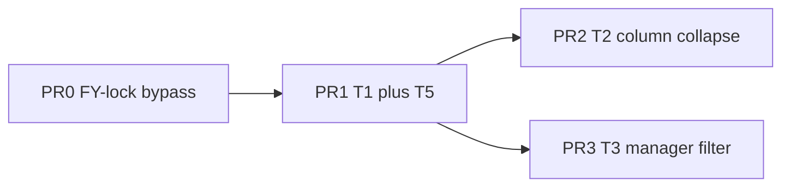

# CBVA Insight — Implementation Plan (31 Aug 2026)

Source of truth: [`docs/AUDIT_2026-08.md`](AUDIT_2026-08.md) (including Addendum). No new product assumptions.

**This pass:** local working-tree changes on the current branch. No PRs, no feature branches, no push until local testing is signed off.

Living tracker: [`docs/IMPL_STATUS_2026-08-31.md`](IMPL_STATUS_2026-08-31.md). Do **not** mark audit Phase 4 as shipped until a PR actually merges.

**Out of scope:** T4, T8 full submit/completeness/round-locking, T6/T7, KRA/appraisal, pipeline snapshot POST/PUT/DELETE (still unguarded; leftover T8).

Solo order: **item 0 → 1 → 2 → 3**. T5 must land before T2 so width-reclaim is not done twice. Labels PR0–PR3 are future PR names; they are not opened in this pass.

---

## Hard rules

- If a decision is not already in the audit/addendum, **stop and flag** — do not guess.
- Frontend has **no test setup**. Do not add Vitest/Jest.
- Backend: add tests in `backend/tests/` following the existing httpx + `conftest.auth_header` pattern. Seed `financial_years` explicitly.
- After each work item: update the status doc. Do not mark audit Phase 4 shipped yet.

---

## PR0 — Close unguarded FY-lock bypass

Add `assert_fy_editable` (admin bypass already inside `is_fy_editable`) to:

- `PUT /api/pipeline/fy-actuals` — lock `body.fiscal_year` (the prior year being written)
- `POST /api/baselines/` — lock `body.financial_year_id`
- `PUT /api/baselines/{id}` — lock `existing["financial_year_id"]`; also reject non-admin writes when `is_locked` is true
- `PUT /api/el-summary/{id}` — lock `existing["fiscal_year"]`

If `baseline_plans.financial_year_id` is not a 4-char slug, stop and flag.

Tests: `backend/tests/test_fy_lock_write_gaps.py`.

Not in this item: `POST/PUT/DELETE /api/pipeline/` snapshots.

---

## PR1 — T1 + T5 (CSS/width only)

**T1:** Remove `scrollbar-x-none` from the engagements scroll container. Add a 12px visible scrollbar utility for both axes (no invented thumb colour).

**T5:** Named width map as source of truth for colgroup + header/body/footer. Redistribute:

- Manager / Rel. Partner / EL Status: 100 → 88
- Remarks: 320 → 240
- Green / Amber / Blue Sky / Total / Collected / Balance: 96 → 112
- Month sub-cols stay 80
- `#` 32, Client 180, Scope 100, prior-FY 150, expand 32 unchanged

Keep `table-layout: fixed`.

---

## PR2 — T2 column collapse

Session-only `useState` (resets on remount). Default all three visible. No `localStorage`.

Hide/collapse Manager, Rel. Partner, EL Status. `#`, Client, optional Scope stay sticky. Hidden columns omitted from colgroup/header/body/footer so width is reclaimed to the right. Columns control next to Filters.

Extend `frontend/src/lib/fyTableConfig.js` rather than duplicating.

---

## PR3 — T3 manager filter

1. Extend `DESIGNATION_ORDER` / `TEAM_DESIGNATIONS` to the addendum ladder (no Analyst, no Consultant). Do not change the hiring Level dropdown.
2. One-off script `backend/scripts/list_malformed_designations.py` — print the 6 name-as-designation rows, do not auto-fix.
3. Filter team/firmwide names with `designationRank(d) >= designationRank("Assistant Manager")`. Keep `uniqueManagers(clients)` and leader names unfiltered (option a). Shared helper so EngagementsTable and AddEngagementModal cannot drift. Pass the same `managerOptions` into ClientFilterPanel.

Unknown strings (`Consultant`, the 6 malformed rows, `"Other"`) rank last and therefore pass the cutoff until data is cleaned. Do not special-case them in code.

---

## Stop-and-flag list

- `baseline_plans.financial_year_id` is not a 4-char slug
- Need to lock pipeline snapshots (POST/PUT/DELETE) — leftover T8, not PR0
- Any request to persist column visibility, change the AM cutoff, add Consultant, or auto-fix the 6 designation rows
